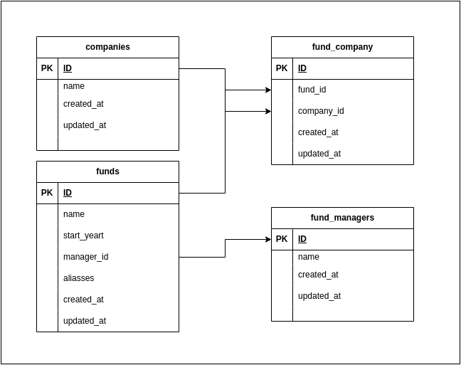

## Canoe Tech Assessment

- Backend: Leveraged Laravel 10, a prominent PHP framework.
- Database Management: Utilized MYSQL 8.0 for robust data storage and retrieval.

## INSTALL
1. Clone the Canoe repository to your local environment
```bash
git clone git@github.com:gregoryoliveiraa/canoe.git
```
2. enter on canoe folder and Run the installation file to set up the environment.
```bash
cd canoe
sudo chmod +x install.sh
sudo ./install.sh
```

### API:
I created a POSTMAN collection to just import and run the endpoints. This collection, named "CANOE", provides a comprehensive set of endpoints related to the management and retrieval of funds, fund managers, and companies.
Endpoints included are:
List Funds: This fetches a list of funds, with optional query parameters for filtering by fund name and start year.
List FundsManagers: Retrieves a list of all the fund managers in the system.
List Companies: Fetches a comprehensive list of companies.
Show Fund: This is used to get detailed information about a specific fund by providing its unique identifier.
Create Funds: Enables the user to add a new fund to the system by sending the relevant details in the request body.
Modify Funds: Used for updating the information of an existing fund using its unique identifier and sending the new details in the request body.
Dump duplicates: Provides a list of funds that are considered duplicates based on certain criteria. It accepts a query parameter for filtering the results by start year.
Each endpoint comes equipped with pre-configured headers, query parameters, and request bodies to facilitate easy testing. For endpoints that require request bodies, sample JSON payloads are provided to illustrate the expected format. Simply import this collection into POSTMAN, set up any required environment variables, and you are ready to start testing the CANOE API.

collectionPostman.json

## Scalability considerations:

Caching Mechanisms: By setting up caches, you can store frequently used data temporarily so that the system doesn't have to fetch it from the primary source every time. This can significantly reduce unnecessary database queries and speed up data retrieval.
Pagination: This involves breaking down the data into smaller chunks, so that only a subset of the data is retrieved and displayed at a time. This can enhance the user experience by ensuring faster load times.
Infrastructure Scaling: As demand grows, it might be necessary to add more servers or computational resources to handle the increased load.
Continuous Monitoring: By keeping an eye on system performance, you can identify and rectify bottlenecks early.
Data Maintenance: Periodically cleaning up old or unused data can help in maintaining system efficiency.
Rate Limiting: By controlling the number of requests a user can make in a given timeframe, you can prevent system overloads.
Redundancy and Fail-over Mechanisms: To ensure that your application is always available, it's essential to have backup systems that can take over if the primary system fails.
Enhanced Error Handling and Logging: When issues arise, efficient error-handling and logging mechanisms can help in quickly identifying and addressing the root cause.
Testing: Regular load and performance testing can provide insights into how the system behaves under stress and identify areas that need optimization.



