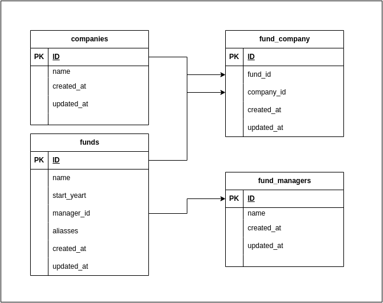

## Canoe Tech Assessment

- Backend: Leveraged Laravel 10, a prominent PHP framework.
- Database Management: Utilized MYSQL 8.0 for robust data storage and retrieval.

## INSTALL
1. Clone the Canoe repository to your local environment
```bash
git clone git@github.com:gregoryoliveiraa/canoe.git
```
2. enter on canoe folder and Run the installation file to set up the environment.
```bash
cd canoe
sudo chmod +x install.sh
sudo ./install.sh
```

### API:
I created a POSTMAN collection to just import and run the endpoints. This collection, named "CANOE", provides a comprehensive set of endpoints related to the management and retrieval of funds, fund managers, and companies. Endpoints included are:
1. **List Funds:** This fetches a list of funds, with optional query parameters for filtering by fund name and start year.
2. **List FundsManagers:** Retrieves a list of all the fund managers in the system.
3. **List Companies:** Fetches a comprehensive list of companies.
3. **Show Fund:** This is used to get detailed information about a specific fund by providing its unique identifier.
4. **Create Funds:** Enables the user to add a new fund to the system by sending the relevant details in the request body.
5. **Modify Funds:** Used for updating the information of an existing fund using its unique identifier and sending the new details in the request body.
6. **Dump duplicates**: Provides a list of funds that are considered duplicates based on certain criteria. It accepts a query parameter for filtering the results by start year.

Each endpoint comes equipped with pre-configured headers, query parameters, and request bodies to facilitate easy testing. For endpoints that require request bodies, sample JSON payloads are provided to illustrate the expected format. Simply import this collection into POSTMAN, set up any required environment variables, and you are ready to start testing the CANOE API.

[-> collectionPostman.json](https://github.com/gregoryoliveiraa/canoe/blob/main/collectionPostman.json)

## Scalability considerations:
As our application continues to evolve, we're committed to ensuring it remains efficient and reliable, even as the data set balloons and the number of simultaneous users surges. Here's how we plan to tackle these challenges:

Firstly, to manage the burgeoning data efficiently, we'll implement caching mechanisms. This will drastically cut down on unnecessary data queries, making information retrieval swifter. Additionally, we'll employ pagination. Instead of overwhelming the system by pulling all data at once, pagination allows us to retrieve and display data in manageable, smaller segments, ensuring smooth operation.

Considering user growth, adding more servers will be vital. An increased server capacity ensures that we can comfortably handle a higher load, preventing slowdowns or crashes. Furthermore, it's not just about accommodating more users; it's about providing each of them with a seamless experience. To that end, continuous monitoring is in place. By keeping a vigilant eye on our system, we can promptly identify and address any bottlenecks, ensuring optimal performance at all times.

We're also keen on maintenance. Regular cleanups will be conducted to rid the system of old or unused data, ensuring that our databases remain lean and efficient. Moreover, to prevent system overloads, we'll implement rate limits. This means controlling the number of requests a user can make within a certain time frame, preventing any single user or group from overwhelming the system.

But what about unforeseen challenges? We've got that covered too. With fail-over and redundancy mechanisms in place, we'll ensure that our application remains available even when certain components face issues. And if something does go awry, our improved error handling and logging mechanisms will allow us to swiftly identify and rectify the problem.

Lastly, we aren't just waiting for challenges to arise. We're proactive. Through regular load and performance tests, we'll simulate high-stress scenarios to uncover areas that need bolstering. By doing this, we ensure that when real-world challenges do emerge, our system is more than ready to handle them.

In essence, every step we're taking is geared towards making our project not just bigger, but markedly better for every user.


